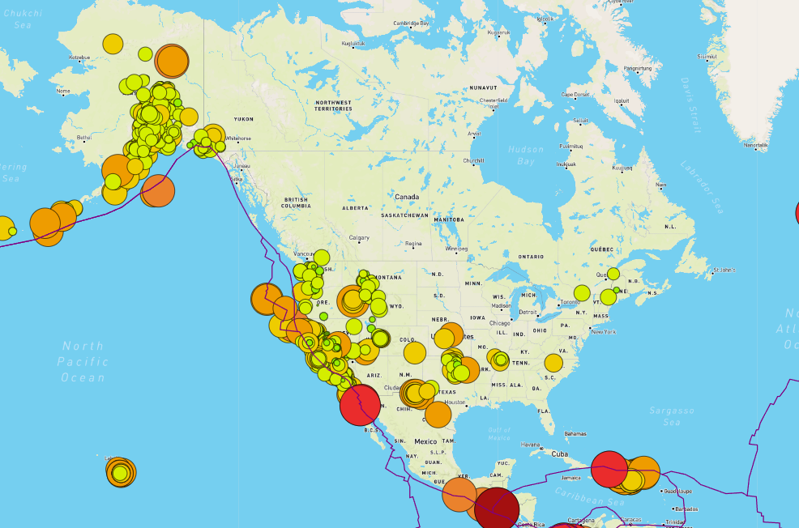

# Mapping Earthquakes
An interactive map showing earthquake locations and severity using JavaScript, Mapbox APIs, HTML and CSS. GeoJSON data was retrieved and mapped onto a high resolution map with meta details on pop-up.

